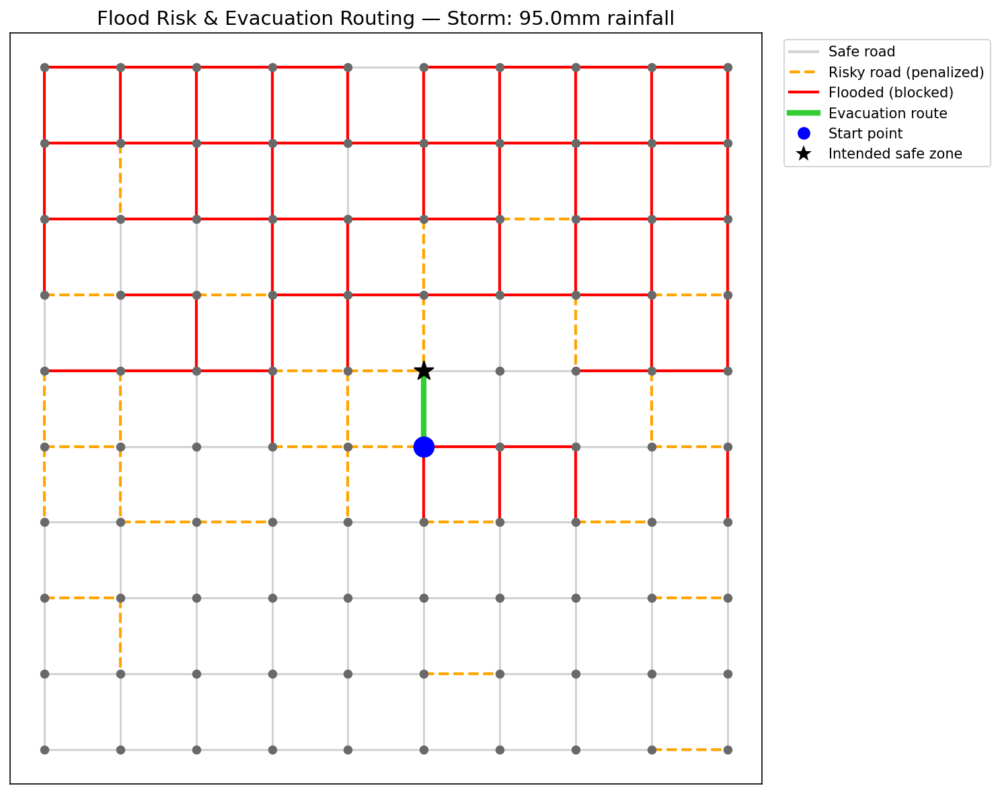

# 🌊 Urban Flood Risk Prediction & Evacuation Routing

A machine learning system that predicts which roads will flood during a storm, 
then automatically finds the safest evacuation route through a city — and 
adapts in real time if the intended safe zone becomes unreachable.

This is a simplified, simulated version of a real "urban digital twin" concept 
used in disaster-response planning, built as a learning project to understand 
the full pipeline: data → machine learning → decision-making → visualization.

## What it does

1. **Simulates a city** — a 10x10 grid of intersections with realistic elevation 
   and population density patterns
2. **Simulates 50 historical storms** — generating road-level flood outcomes based 
   on rainfall, elevation, and drainage quality
3. **Trains a Random Forest classifier** to predict flood risk per road, achieving 
   **84.3% accuracy** on unseen test data
4. **Predicts flooding for a new incoming storm** (95mm rainfall) across all roads
5. **Builds an evacuation route** using graph search (Dijkstra's algorithm via 
   NetworkX), avoiding roads predicted to flood
6. **Handles cut-off scenarios** — if the intended safe zone becomes unreachable, 
   the system automatically finds the nearest reachable alternative
7. **Visualizes** the flood risk map and evacuation route

## Results

**Scenario: Safe zone unreachable, system finds an alternative**

The intended safe zone (top-right) became completely cut off by flooding. 
The system correctly detected this and suggested the nearest reachable 
alternative instead of failing.

## Tech stack

- **Python** — pandas, numpy
- **scikit-learn** — Random Forest classifier
- **NetworkX** — graph-based route finding (Dijkstra's algorithm)
- **Matplotlib** — visualization

## How to run

1. Open `Untitled4.ipynb` in [Google Colab](https://colab.research.google.com)
2. Run all cells in order (**Runtime → Run all**)
3. The model trains automatically and the evacuation map renders at the bottom

## What's simulated vs. real

This project uses a **simulated city and simulated storm history** to focus on 
learning the ML and routing pipeline without needing GIS data or API access. 
A production version would replace the simulated data with:
- Real elevation data (e.g. USGS, OpenTopography)
- Real historical flood records (e.g. FEMA, local municipal data)
- Live weather forecast APIs
- Real road network data (e.g. OpenStreetMap)

## Model performance

| Metric | Score |
|---|---|
| Accuracy | 84.3% |
| Precision (Flooded) | 0.85 |
| Recall (Flooded) | 0.85 |

## Author

Built as a hands-on introduction to applied machine learning, covering data 
simulation, classification, graph algorithms, and result visualization.
